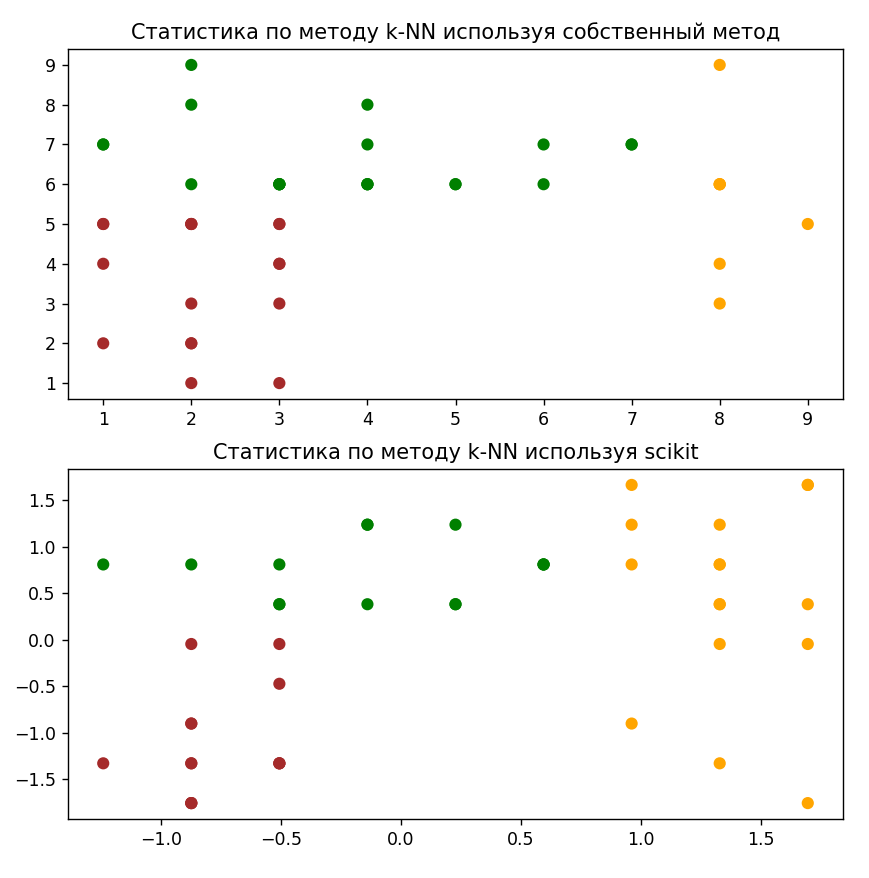

# Классификация. Метод к – ближайших соседей (k-NN)
1. Создать симулированный набор данных и записать его на диск в виде csv файла со следующими параметрами:
- продукт;
- сладость;
- хруст;
- класс.

| Product       | Sweetness       | Crunch        |Product Category|
|:-------------: |:---------------:| :-------------:| :-------------:|
| Яблоко      | 7 |    7 | Фрукт |
| салат     |2 |  5| Овощ |
| бекон | 1 |2 | Протеин |
| банан | 9 | 1 | Фрукт |
| орехи | 1 | 5 | Протеин |
| рыба | 1 | 1 | Протеин |
| сыр | 1  | 1 | Протеин |
| виноград |8 | 1 | Фрукт |
| морковь | 2 | 8 | Овощ |
| апельсин | 6 | 1 | Фрукт |

2. Подготовить для классификации несколько примеров в соответствии с рисунком 

3. Запрограммировать метрический классификатор по методу k-NN. Для проверки решить ту же задачу методом k-NN библиотеки sklearn.
4. Прочитать сгенерированный набор данных. Настроить классификатор. Провести эксперимент по классификации с контролем для подготовленных примеров. 
5. По возможности результаты визуализировать.
6. Ввести в набор данных и примеры продукты еще одного класса (возможно изменив набор параметров) и повторить эксперимент.
7. По результатам эксперимента подготовить отчет по лабораторной работе. 

# Отчет:
1. Создать симулированный набор данных и записать его на диск в виде csv файла со следующими параметрами:

2. Подготовить для классификации несколько примеров в соответствии с рисунком 

3. Запрограммировать метрический классификатор по методу k-NN.

Для проверки решить ту же задачу методом k-NN библиотеки sklearn.

4. Прочитать сгенерированный набор данных. Настроить классификатор. Провести эксперимент по классификации с контролем для подготовленных примеров.
Собственный метод:

Используя sclearn:

5. По возможности результаты визуализировать.

Приведенный график совпадает с приведенным графиком распределения.

6. Ввести в набор данных и примеры продукты еще одного класса (возможно изменив набор параметров) и повторить эксперимент.
Добавлена категория - снеки:

Пустующие области на графике заполнены новой категорией.
Приведенные графики совпадают с приведенным графиком в задании.	

7. По результатам эксперимента подготовить отчет по лабораторной работе.

Качество работы классификаторов оценено при помощи следующих параметров:
Accuracy - доля правильных ответов алгоритма
Precision - доля объектов, названных классификатором положительными и при этом действительно являющимися положительными
Recall - доля найденных объектов положительного класса из всех объектов положительного класса
F1-score - среднее гармоническое precision и recall
Support - количество фактических вхождений
Метод k-ближайших соседей — метрический классификатор, основанный на оценивании сходства объектов. Классифицируемый объект относится к тому классу, которому принадлежат ближайшие к нему объекты обучающей выборки.