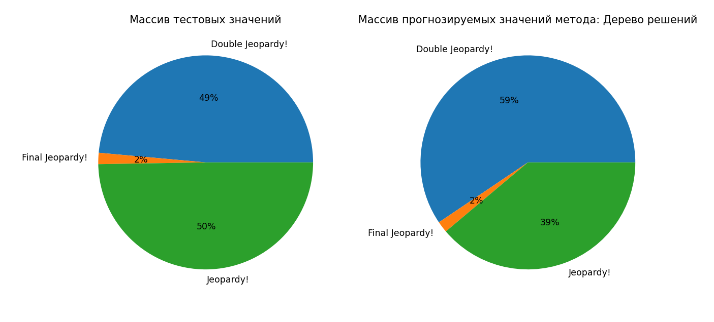

# Исследование инструментов классификации библиотеки Scikit-learn
Для выполнения лаборатоной работы выбраны следующие классификаторы:
1. Дерево решений
2. Метод k-NN соседей
3. Прецептрон
И следующий датасет:
https://www.reddit.com/r/datasets/comments/1uyd0t/200000_jeopardy_questions_in_a_json_file/

Данные представляют собой таблицу с информацией о популерном телешоу, суть в котом, что участникам предлагают ответить на вопросы из различных категорий. Также в передаче есть раунды (Round).
Целевым столбцом был выбран Round для классфикации раундов.

Подготовка данных:

Визуализация тестового массива и массива прогнозируемых значений Дерева решений:

Совпадение тестовых данных и предсказанные Деревом решений:

Визуализация тестового массива и массива прогнозируемых значений Метода k-NN соседей:

Совпадение тестовых данных и предсказанного методом k-NN соседей:

Визуализация тестового массива и массива прогнозируемых значений Прецептроном:

Совпадение тестовых данных и предсказанного Прецептроном:

Вывод: В ходе работы был обработан датасет данных с помощью 3-х методов классификации. Получены итоговые данные. Наиболее подходящим методом для этих конкретных исходных данных является "Дерево решений" по причине наибольшей оценки точности.
